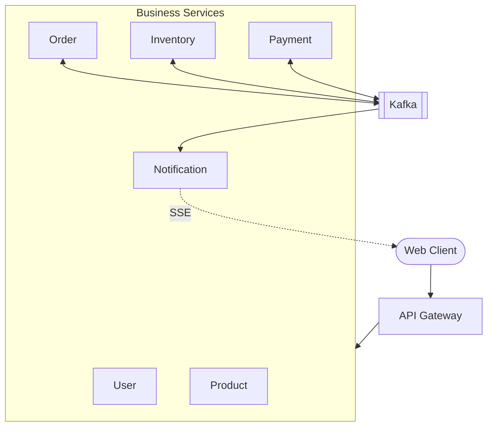
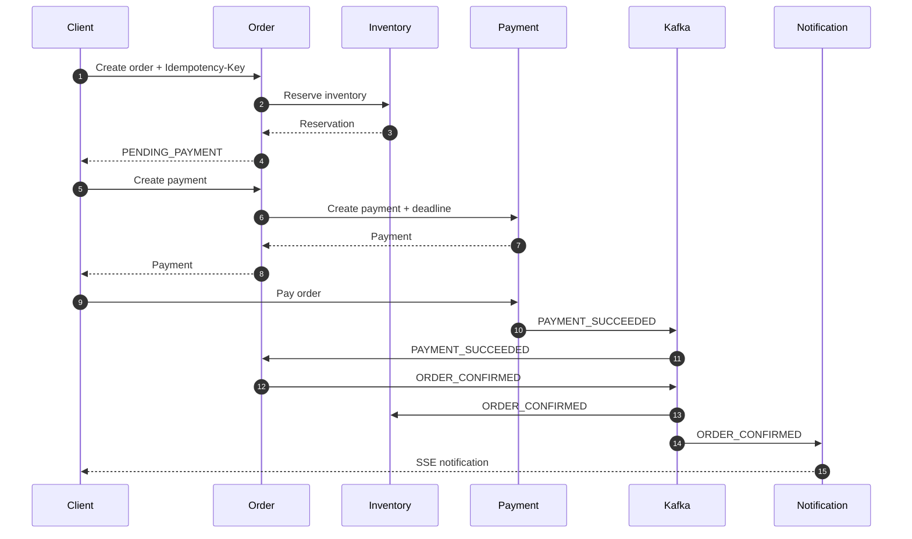
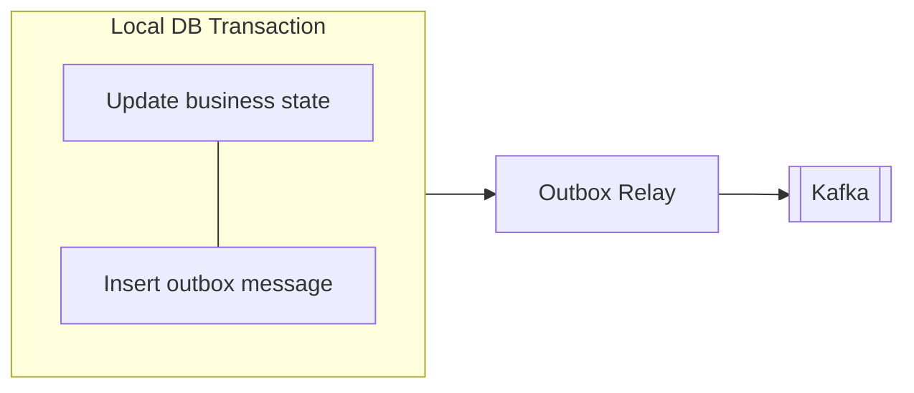
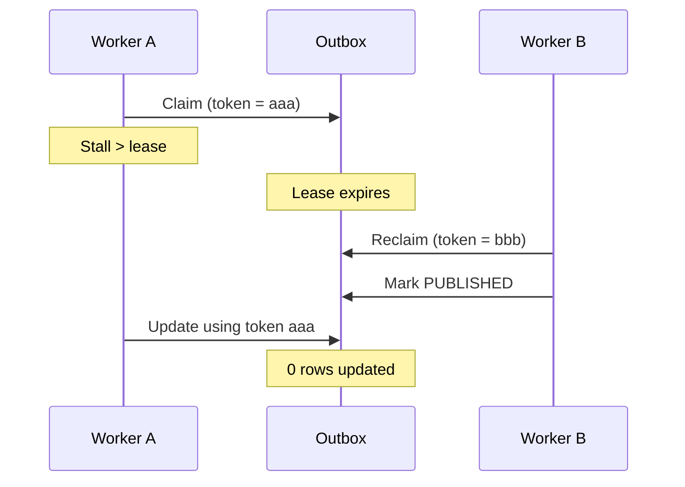

# Mini Store

Hệ thống thương mại điện tử theo kiến trúc microservices, tập trung vào một bài toán chính:

> **Làm thế nào giữ dữ liệu nhất quán khi một giao dịch nghiệp vụ trải qua nhiều service và bất kỳ service nào cũng có thể lỗi giữa chừng?**

**Java 21 · Spring Boot 3.5 · Kafka · MariaDB · Redis · MinIO**

Các kỹ thuật chính:

* Saga choreography và compensating transaction
* Transactional Outbox với concurrent relay
* At-least-once delivery và idempotency
* Per-key event ordering
* Deadline propagation giữa reservation và payment
* Pessimistic locking để chống oversell
* Presigned upload, SSE và Kafka batch consumer cho email

---

## Architecture



Hệ thống sử dụng hai kiểu giao tiếp:

* **HTTP** cho các truy vấn cần kết quả ngay, chẳng hạn Order lấy giá từ Product hoặc yêu cầu Inventory giữ hàng.
* **Kafka** cho các thay đổi trạng thái đã xảy ra và cần được các service khác phản ứng bất đồng bộ.

Mỗi service chỉ đọc/ghi bảng của mình; cần dữ liệu của service khác thì gọi HTTP hoặc nghe event. Bản demo dùng chung một MariaDB (`ecommerce_db`), tách theo bảng. Không có transaction phân tán hay 2PC giữa các service.

---

## Order flow



Tồn kho được **reserve** trước khi thanh toán và chỉ được finalize sau khi đơn được xác nhận.

Reservation có thời hạn. Nếu khách không hoàn tất thanh toán, reservation được giải phóng và Order chuyển sang trạng thái thất bại.

## Payment deadline

Reservation và payment đều có thời hạn, nhưng tính từ hai mốc khác nhau:

```text
reservation   30m kể từ lúc tạo order
payment       15m kể từ lúc tạo payment
```

Nếu hai hạn này độc lập, payment có thể sống lâu hơn reservation: khách vẫn trả được tiền sau khi hàng đã được nhả và Order đã `FAILED`.

Deadline vì vậy được truyền theo chuỗi gọi, Inventory là nguồn duy nhất:

```text
Inventory ── reservation.expiresAt = T ────► Order
Order     ── deadline = T − margin ─────────► Payment
Payment   ── expiresAt = min(now + ttl, deadline)
```

* `expiresAt` của payment sớm hơn hạn reservation ít nhất một `margin` (mặc định 2m), chừa thời gian cho một payment thành công sát giờ đi qua outbox tới Order và Inventory. Hết hạn thì đi theo luồng `PAYMENT_EXPIRED` có sẵn.
* Còn ít hơn một `margin` để trả tiền thì Order từ chối tạo payment (`409`).
* Nếu reservation vẫn hết hạn khi Order đã `CONFIRMED` (đã thu tiền), Order không bị chuyển sang `FAILED`; event `RESERVATION_EXPIRED` đi vào DLT để xử lý tay (lúc đó Inventory đã nhả hàng).

Deadline được truyền dưới dạng mốc thời gian tuyệt đối, nên độ trễ giữa các lần gọi không làm lệch hạn.

---


# Reliability

## Transactional Outbox

Một business transaction thường cần thực hiện hai việc:

```text
1. Commit trạng thái vào database
2. Publish event lên Kafka
```

Hai thao tác này không thể commit atomically với nhau.

Nếu database commit thành công nhưng process chết trước khi publish event, state và event sẽ bị lệch nhau.

Project giải quyết bằng **Transactional Outbox**:



Business state và outbox message được ghi trong **cùng một database transaction**.

Kafka không còn nằm trên critical transaction path. Một background relay chịu trách nhiệm publish các message trong outbox.

Order, Payment và Inventory đều sử dụng cùng mô hình này.

---

## Concurrent Outbox Relay

Nhiều instance của cùng một service có thể chạy relay đồng thời.

Claim query sử dụng:

```sql
FOR UPDATE SKIP LOCKED
```

`FOR UPDATE` đảm bảo một row chỉ được một worker claim tại một thời điểm.

`SKIP LOCKED` cho phép các worker khác bỏ qua những row đang được xử lý thay vì phải chờ lock.

```text
Relay A                   Relay B

message 101  ← claimed    101 → skip
message 102  ← claimed    102 → skip
                           103 ← claimed
                           104 ← claimed
```

Database lock chỉ tồn tại trong transaction claim ngắn; relay không giữ DB lock trong lúc gọi Kafka.

---

## Lease and fencing token

Database lock giải quyết tranh chấp tại **thời điểm claim**, nhưng không giải quyết trường hợp worker chết sau khi đã claim.

Mỗi message được gắn:

```text
status       = PROCESSING
locked_until = lease expiry
lock_token   = unique owner token
```

Nếu worker chết và lease hết hạn, worker khác có thể claim lại message.



Mọi update cuối cùng đều yêu cầu:

```sql
WHERE lock_token = ?
```

`locked_until` cho phép **recovery**, còn `lock_token` hoạt động như một **fencing token**, ngăn worker cũ cập nhật state sau khi quyền sở hữu đã được chuyển cho worker khác.

Worker crash thì mất luôn token (token chỉ nằm trong bộ nhớ của lần chạy đó); thứ fencing token chặn là worker **còn sống nhưng bị treo** quá lease rồi chạy tiếp: update của nó vào outbox trúng 0 row, còn message nó gửi lên Kafka vẫn đi và thành bản trùng.

---

## Claim query

Một message chỉ được claim khi:

* đang `PENDING` và đã đến thời điểm retry;
* hoặc đang `PROCESSING` nhưng lease đã hết hạn;
* không có message trước nó của cùng `message_key` chưa được publish;
* nằm trong batch hiện tại;
* chưa bị worker khác lock.

```sql
select candidate.*
from order_outbox_messages candidate
where (
        (
            candidate.status = 'PENDING'
            and candidate.next_attempt_at <= :now
        )
        or
        (
            candidate.status = 'PROCESSING'
            and candidate.locked_until <= :now
        )
      )
  and not exists (
        select 1
        from order_outbox_messages predecessor
        where predecessor.message_key = candidate.message_key
          and predecessor.id < candidate.id
          and predecessor.status <> 'PUBLISHED'
      )
order by candidate.id
limit :batchSize
for update skip locked;
```

`message_key` là `orderId`.

Vì vậy, tại một thời điểm chỉ message chưa publish sớm nhất của mỗi order có thể được claim.

Điều này vừa giữ **event ordering theo aggregate**, vừa cho phép các order độc lập được publish song song.

---

## At-least-once and idempotency

Transactional Outbox ưu tiên **không mất event**.

Nếu Kafka đã nhận message nhưng acknowledgement bị mất, relay có thể gửi lại message đó.

Vì vậy delivery semantics là:

```text
at-least-once
      ↓
duplicate có thể xảy ra
      ↓
consumer phải idempotent
```

Các consumer đổi state (Order, Inventory, Payment) dùng domain state để nhận biết replay; notification history upsert theo `orderId`. Riêng consumer gửi email là best-effort: không dedupe (event trùng thì gửi trùng mail), và lô chạy quá `window` (mặc định 30s) vẫn commit offset dù mail chưa gửi xong.

Ví dụ:

```text
PAYMENT_SUCCEEDED
        ↓
Order đang ở state nào?
        ├── CONFIRMED       → duplicate, ignore
        ├── PENDING_PAYMENT → apply transition
        └── state khác      → reject (non-retryable → DLT)
```

Project không dùng Inbox table; dedupe dựa trên state hiện tại như sơ đồ trên.

### HTTP idempotency

`POST /api/orders` yêu cầu `Idempotency-Key`.

Server lưu:

```text
idempotency key + request hash + order
```

Kết quả:

```text
key mới
→ tạo order

key cũ + cùng request hash + đã COMPLETED
→ trả lại order đã tạo

key cũ + cùng request hash + PROCESSING / FAILED
→ 409 conflict (request đã lỗi thì phải dùng key mới)

key cũ + khác request hash
→ reject conflict
```

Request hash ngăn cùng một key bị tái sử dụng cho hai ý định nghiệp vụ khác nhau.

---

## Per-key event ordering

Key Kafka là `orderId`, nên event của cùng một order vào cùng partition và giữ thứ tự ở đó.

Thứ tự có thể lệch ở phía relay: message trước gửi lỗi, chờ retry, trong lúc đó message sau đã được gửi đi. Order và Payment relay chặn việc này ngay trong claim query:

```text
order-42

#100  PUBLISHED
#110  PROCESSING
#120  PENDING
```

`#120` không thể được claim cho đến khi `#110` trở thành `PUBLISHED`.

Ordering chỉ được áp dụng **theo `message_key`**, không phải toàn hệ thống, nên các order độc lập vẫn có thể chạy song song.

---

## Retry and failed messages

Nếu publish Kafka thất bại, relay lên lịch retry.

Order và Payment relay: sau `maxAttempts` lần thất bại (mặc định 10), message chuyển sang:

```text
FAILED
```

Inventory relay không giới hạn số lần: retry với exponential backoff (tối đa 60s), chỉ chuyển `FAILED` khi gặp lỗi không thể retry (serialization, record quá lớn, sai topic, auth/config).

Outbox table chính là durable store của producer-side failure.

Không cần publish một producer failure sang Kafka DLT khi Kafka chính là dependency đang không nhận message.

Consumer-side failure vẫn sử dụng Kafka retry/DLT riêng.

---

# Concurrency and inventory consistency

## Preventing oversell

Inventory reservation sử dụng **pessimistic locking**.

Khi một order chứa nhiều product, các inventory row luôn được lock theo thứ tự `productId` cố định.

```text
Order A: product 10 → 20
Order B: product 10 → 20
```

Thay vì:

```text
Order A: 10 → 20
Order B: 20 → 10
```

Thứ tự lock nhất quán giúp tránh deadlock khi hai transaction cùng thao tác trên nhiều sản phẩm.

Redis có thể được bật như một pre-filter cho hot products, nhưng Redis không phải source of truth.

Filter chỉ có hai kết quả:

```text
definitely insufficient
unknown
```

Chỉ database (dưới lock) mới quyết định cho giữ hàng; cache chỉ có thể từ chối sớm. Vì vậy stale cache không thể gây oversell, tệ nhất là từ chối nhầm cho tới lần refresh kế tiếp hoặc hết TTL (mặc định 60s).

---

# Other design decisions

### Direct object-storage upload

Backend không proxy image bytes.

```text
Browser
   │
   │ request upload permission
   ▼
Product Service
   │
   │ presigned PUT URL
   ▼
Browser ───────────────► MinIO
          image bytes

Browser ── objectKey ──► Product Service
```

Product Service chỉ cấp presigned URL và sau đó lưu `objectKey` vào product.

---

### Real-time notification

Notification history được persist trước, sau đó push tới client qua **Server-Sent Events (SSE)**.

SSE phù hợp vì notification là luồng một chiều:

```text
Server ─────────► Client
```

---

### Authentication

API Gateway:

* verify JWT bằng RSA public key;
* chặn `/api/admin/**` theo role;
* route request tới các service phía sau.

User Service giữ private key và chịu trách nhiệm phát token.

---

# API overview

Path public/admin đều có prefix `/api` (vd `/api/auth/*`, `/api/admin/products/*`); `/internal/*` thì không.

### Public

```text
/auth/*             authentication & password reset
/products/*         catalog
/cart/*             Redis-backed cart
/orders/*           order lifecycle
/notifications/*    history + SSE
```

### Admin

```text
/admin/products/*
/admin/categories/*
/admin/inventory/*
/admin/orders
/admin/users
/admin/catalog
```

### Internal

```text
/internal/*
```

Dùng cho service-to-service calls như inventory reservation, tạo payment (`/internal/payments`), batch inventory lookup và batch user-email lookup. Riêng batch product lookup của Order gọi thẳng `POST /api/products/batch` (gateway chỉ route `GET` cho products nên endpoint này không gọi được qua gateway).

---

# Running locally

```bash
./scripts/start-stack.sh

# optional observability stack
./scripts/start-stack.sh --otel
```

| Service       | URL                   |
| ------------- | --------------------- |
| API Gateway   | http://localhost:8080 |
| Kafka Console | http://localhost:8085 |
| MailHog       | http://localhost:8025 |
| MinIO Console | http://localhost:9011 |
| Redis Insight | http://localhost:5540 |
| Database UI   | http://localhost:8978 |
