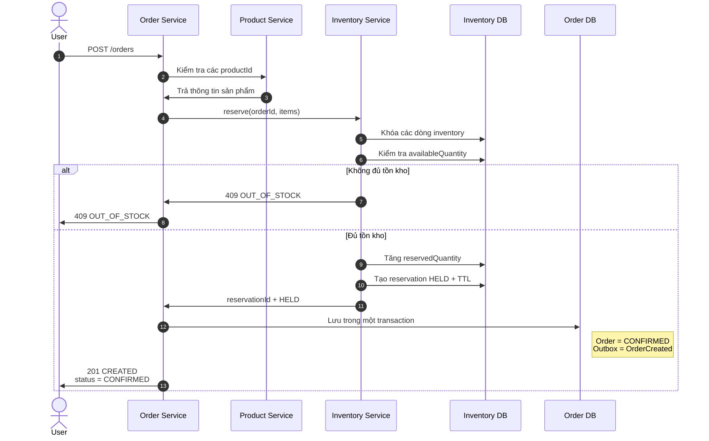

# Tạo đơn và giữ hàng — đồng bộ

Sơ đồ này chỉ mô tả phần xử lý đồng bộ của `POST /orders`. Nếu giữ hàng
thành công, Order được lưu với trạng thái `CONFIRMED` trước khi trả response.

Kết thúc sơ đồ này, `OrderCreated` mới chỉ nằm trong outbox. Kafka chưa tham
gia vào việc quyết định còn hàng hay không.
