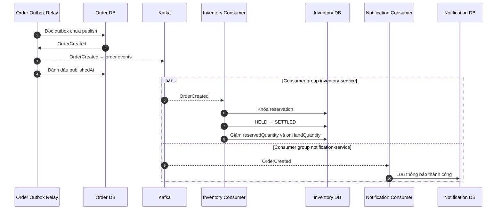

# Hoàn tất reservation — bất đồng bộ

Sơ đồ bắt đầu sau khi Order và `OrderCreated` outbox đã được commit. Hai
consumer group nhận cùng một event và xử lý độc lập.

Quy ước:

- Mũi tên liền: thao tác nội bộ hoặc database.
- Mũi tên đứt: truyền event bất đồng bộ qua Kafka.
- Khối `par`: Inventory và Notification không chờ nhau.

Inventory consumer không tạo reservation `HELD` lần nữa. Reservation đã
được tạo trong luồng đồng bộ; consumer chỉ chuyển `HELD → SETTLED`.
