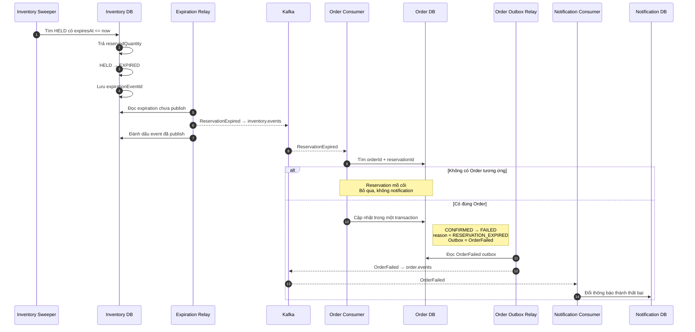

# Reservation hết hạn — luồng ngoại lệ

Sweeper chỉ xử lý reservation vẫn còn `HELD` khi đã quá `expiresAt`.

Reservation mồ côi là trường hợp Inventory giữ hàng thành công nhưng Order
Service chết hoặc rollback trước khi lưu Order. Order bị người dùng hủy nên
có luồng release riêng, không nên chờ TTL.
